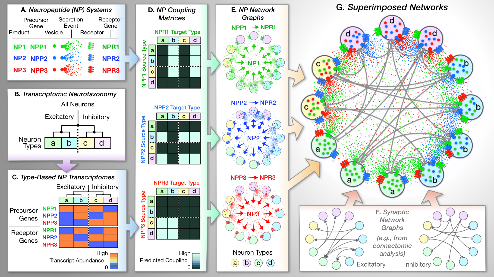

### [Single-Cell Transcriptomic Evidence for Dense Intracortical Neuropeptide Networks](https://elifesciences.org/articles/47889)
Stephen J Smith, Uygar Sümbül, Lucas T Graybuck, Forrest Collman, Sharmishtaa Seshamani, Rohan Gala, Olga Gliko, Leila Elabbady, Jeremy A Miller, Trygve E Bakken, Jean Rossier, Zizhen Yao, Ed Lein, Hongkui Zeng, Bosiljka Tasic, Michael Hawrylycz

#### Abstract
Seeking insight into homeostasis, modulation and plasticity of cortical synaptic networks, we analyzed results from deep RNA-Seq analysis of 22,439 individual mouse neocortical neurons. This work exposes transcriptomic evidence that all cortical neurons participate directly in highly multiplexed networks of modulatory neuropeptide (NP) signaling. The evidence begins with a discovery that transcripts of one or more neuropeptide precursor (NPP) and one or more neuropeptide-selective G-protein-coupled receptor (NP-GPCR) genes are highly abundant in nearly all cortical neurons. Individual neurons express diverse subsets of NP signaling genes drawn from a palette encoding 18 NPPs and 29 NP-GPCRs. Remarkably, these 47 genes comprise 37 cognate NPP/NP-GPCR pairs, implying a strong likelihood of dense, cortically localized neuropeptide signaling. Here we use neuron-type-specific NP gene expression signatures to put forth specific, testable predictions regarding 37 peptidergic neuromodulatory networks that may play prominent roles in cortical homeostasis and plasticity.

#### About this repository
This repository contains codes and processed data files for analyses presented in the [eLife publication](https://elifesciences.org/articles/47889).

**Figure 1**
 - `Figure 1A NPP Distribution Graphs.xlsx`: Processed data files for Figure 1A.

**Figure 2**
 - `Figure 2A NP-GPCR Distribution Graphs.xlsx`: Processed data for Figure 2A.
 - `np_gpcr_fpkm.csv` and `np_gpcr_cpm.csv`: Differently normalized gene expression counts based on data from [Tasic et al. 2018](https://www.nature.com/articles/s41586-018-0654-5).

**Figure 3**
 - `Figure-3,5` : Data files used in Figures 3 and 5

**Figure 4**

- `singleAE_6_5byExpression.py` and `dualAE_inputZ1_47genes.py`: Autoencoder implementations.
- `quantification_script_gmm.py`: Clustering quantification for autoencoder representations. 
- `Hierarchical_Quantification_notebook.ipynb`: Calculates the average resolution index at every cut of the tree.

**Figure 6**
 - `InteractionPairs.csv` NPP and NPGPCR interaction pairs.
 - `Interaction_ALM.xlsx` and `Interaction_VISp.xlsx`: `celltype x celltype` coupling matrices for different brain regions. 

**Others**
 - `Tables 1 and 2 with source data.xlsx`: Complete datasets for Tables 1 and 2 in the manuscript.
 - `Neuropeptides.r`: Plotting scripts for Figures 3, 5 and 6.
